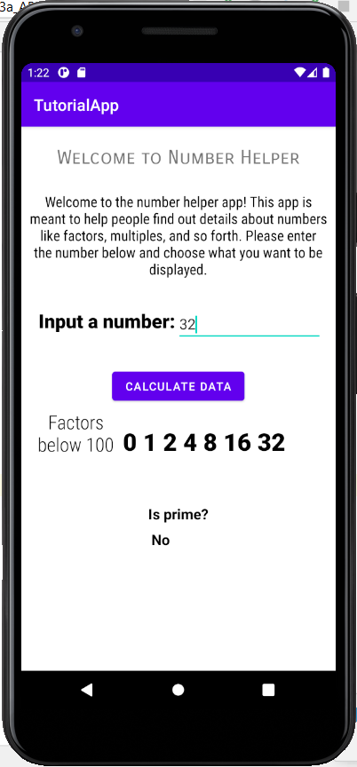

# Overview
A simple math program that displays factors of the number and tells the user if the number is prime or not.

# Developement Enviroment

* Android Studio

# Execution

To run the program: Open the app in an android emulator or use the Android Studio Developer app.

# Useful Information

[Android App developer's guide](https://developer.android.com/guide)
[Kotlin guide](https://kotlinlang.org/docs/reference/)